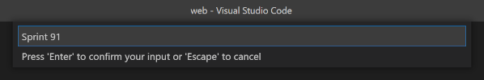
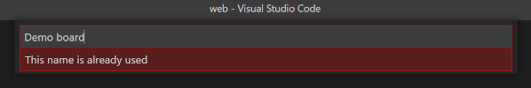
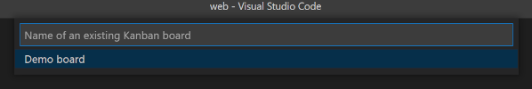
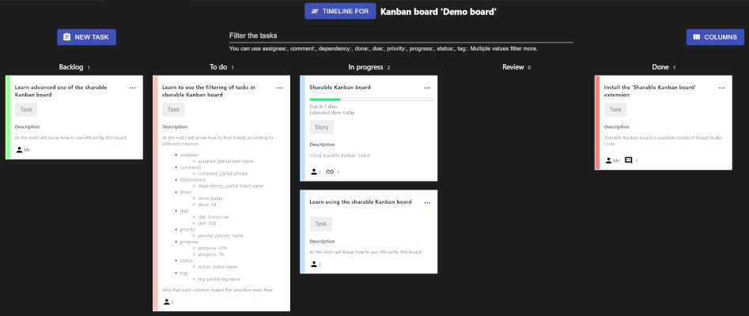
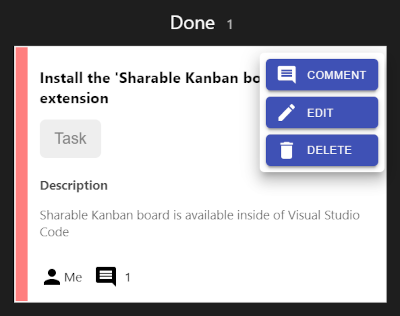
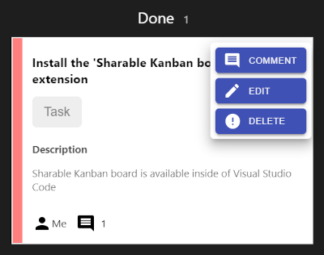
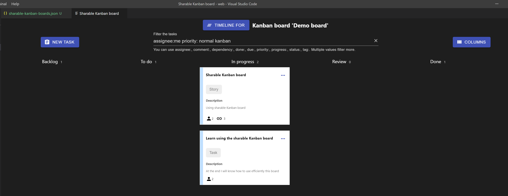
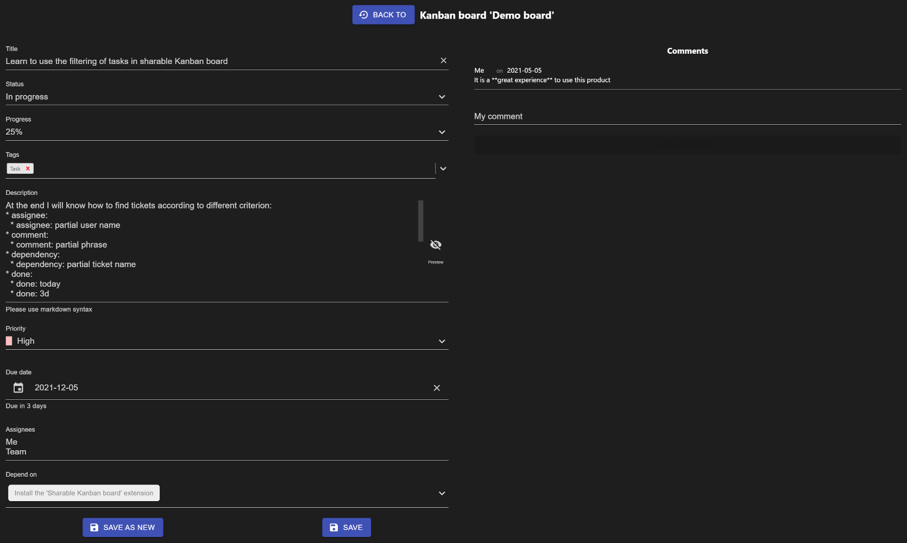
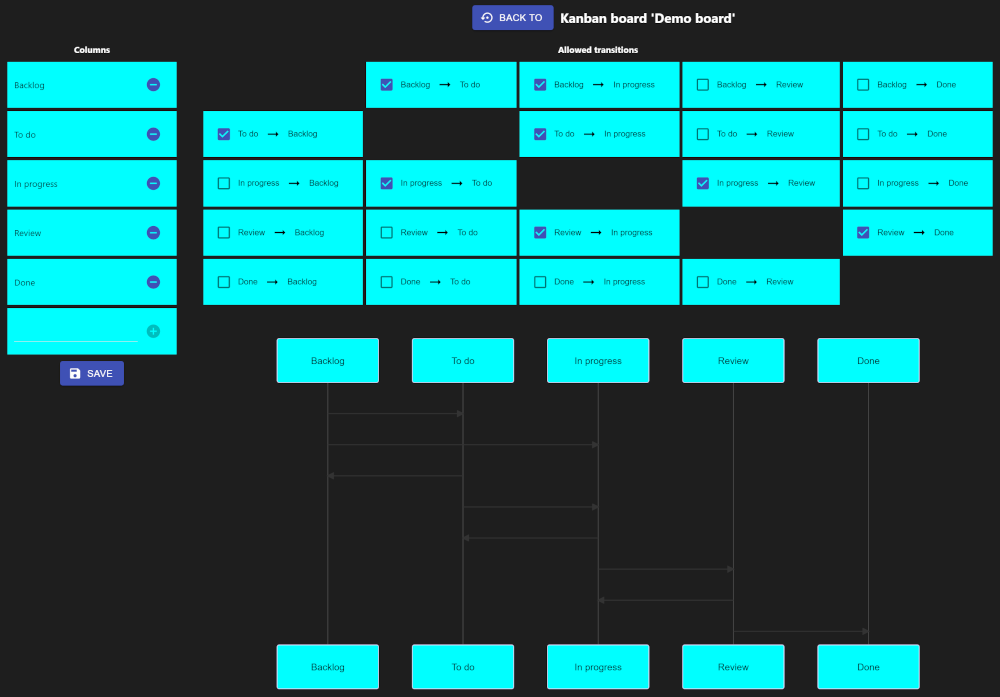
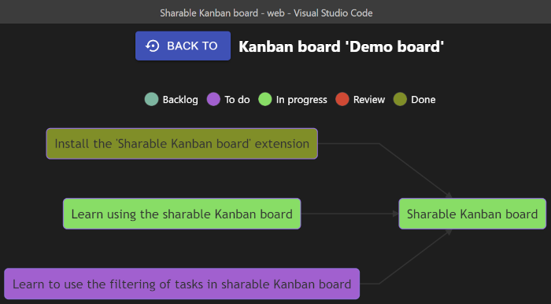

# Shareable Kanban Boards

What if you can habe Kanban boards stored in the same git repo with your project?
It will be great.
Especially because in this way you no longer need to pay for and manage additional tools, and you avoid the effort to mantain the tickets in the sync with the effective progress of the project.

This extension is doing exactly this. Also it is free of charge and it will remain so.
The learning curve of using it is no curve at all, as using it is extremly intuitive.
We also added a few key features for helping you to have a very good visibility over your project.

This extension is an amazing addition for any (new) start-up and all other types of companies.
Start using it today for gaining all beneficies offered by it.

## Usage

This extension makes available the following commands:

- Shareable Kanban boards: Create a new board
- Shareable Kanban boards: Open a board
- Shareable Kanban boards: Delete a board

See below the section **"How to use a Shareable Kanban board"** for a detailed description of how to use this extension.

## Location of saved boards

All Kanban boards are saved in .vscode/sharable-kanban-boards.json and hence you can commit it to your repo.
If you do manual changes in this file, take care to do not corrupt its structure.

## Requirements

There are no special requirements.

## Extension Settings

There are not any custom settings.

## Known Issues

There are not any known issues.

## Change Log

See Change Log [here](CHANGELOG.md)

## Issues

Submit an [issue](https://github.com/iulian-radu-at/sharable-kanban-boards/issues) if you find any bug or have any request.

## Contribution

Fork the [repo](https://github.com/iulian-radu-at/sharable-kanban-boards) and submit pull requests.

---

## How to use a Shareable Kanban board

## Create a board

An input field asks you for the name of the new board. In case this name is already used by a board, a message will be displayed.

If there exists not a .vscode/sharable-kanban-boards.json file, then a new one will be created which will contains a "Demo board".

## Open a board

A list of all available boards is presented to you so you can easily specify which one you want to open.

If there exists not a .vscode/sharable-kanban-boards.json file, then a new one will be created which will contains a "Demo board". This board will be available in the list of available boards.

## Delete a board

A list of all available boards is presented to you so you can easily specify which one you want to delete.

Attention, this operation cannot be reversed.

## Screens

There are four screens:

- Board - It displays all the tickets of a board, grouped in columns by their statuses.
- Task - It allows you to add or edit a task and to add comments.
- Columns - It allows you to manage all defined statuses and the allowed transitions of a ticket between them.
- Timeline - It displays the relations between linked tickets in a clear visual way.

## Board

The board is the core of this extension.
Here you see all the tickets of a board grouped by statuses in columns, and from it you can navigate to the Task, Columns and Timeline screens.

Use the New Task button to create a new ticket in the Task screen. Also you can access the Task screen through the use of a ticket's menu Comment or Edit command.

To delete a ticket use the ticket's menu.
The operation of deletion requires you to click it twice, as this operation cannot be reverted.
As such, this mecanism protects you from the accidental removal of a ticket.

You can filter the tasks by searching for matches in different fields of the tickets.
If no field is specified, then it is assumed to be the title field.
The results are all the tickets matching all the filters.

The following fields are recognized. Any unknown field name is considered to be part of the plain text phrase.
Between the field name and the value (which can be a single word or a phrase, if it is between double quotes) can be any number of spaces.
You cannot escape a double quote inside of a phrase.

| Field name  | Possible values or example         |
| ----------- | ---------------------------------- |
| assignee:   | name of a user                     |
| comment:    | text                               |
| dependency: | title of a ticket                  |
| done:       | today, tomorrow, 12d               |
| due:        | today, tomorrow, 3d                |
| priority:   | lowest, low, normal, high, highest |
| progress:   | ?%, 0%, 25%, 50%, 75%, 100% \*     |
| status:     | name of a column name              |
| tag:        | a tag                              |

\*Priority "?%" means a ticket without a priority set.

The following filter 'word field: "value value2" more words field2: value3 unknown_field: no_value final words' is splitted in:

- word
- field: value value2
- more words
- field2: value3
- unknown_field: no_value final words

It will match all the tickets which:

- have "value value2" as part of their "field" field
- have "value3" as part of their "field2" field
- title matches all three criterion in the same time: "word", "more words", "unknown_field: no_value final words"

## Task

In this screen you can fill or change the fields of a ticket.
The following fields are available:

| Field name  | Meaning                                                                         |
| ----------- | ------------------------------------------------------------------------------- |
| Title       | The subject of the ticket.                                                      |
| Status      | One of the column names defined in Columns screen.                              |
| Progress    | Not defined or 0%, 25%, 50%, 100%.                                              |
| Tags        | Any number of tags.                                                             |
| Description | A more extensive text in Markdown syntax.                                       |
| Priority    | One of Lowest, Low, Normal, High or Highest.                                    |
| Due date    | The latest date when this ticket should be "done".                              |
| Assignees   | A freely defined set of user names.                                             |
| Depend on   | A set of tasks which should be "done" before this one can be considered "done". |
| Comments    | A set of comments made by the users in connection with this ticket.             |

### Progress

If the progress is 25%, 50% or 100%, an estimation done date is computed and displayed in board.
The starting date used for computing the done date is the last date when the ticket was set to have 0% progress or it was moved in a different column (status).

### Tags

A tag can be a single word or a phrase.
A set of tags can be used for example to specify ticket types.
A different set can be used for displaying the estimation of the tickets.

### Description

In this field you need to use the [Markdown](https://www.markdownguide.org/basic-syntax/) syntax. A "cheet sheet" of it can be found [here](http://markdown-it.github.io/).

### Priority

Each priority has a color, which is displayed on the side of the tickets in the board.

### Depend on

Use the screen Timeline to see the dependencies between the tickets, including when they are scheduled to be "done" or expected to be "done".

### Comments

The text in a comment is in plain text, and not Markdown.
The user name used for the author of the comment is extracted from the output of the "git config user.name" command.
If no name is found, the author is marked as "unknown".

## Columns

Here you can define the columns, aka statuses, and the allowed transitions of a ticket between them.

To remove a column, you will need to press twice on the delete button. This is a mechanism to prevent accidental removal of a column, as this operation cannot be reverted.

A diagram of allowed transitions helps you to have a better overwiew of them.

The allowed destinations for a dragged ticket in the board is defined by these allowed transitions and the status of the linked (depend on) tickets.
A ticket cannot be moved to a column more to the right than to the leftmost of all depending tickets' columns.

## Timeline

Here are displayed the relations between the tickets, together with their due and estimated done dates.
If a ticket has both a due and an estimated done date, only the due date will be displayed.

The status of the tickets (in which columns are they located) is represented with different colors.
A legend at the top of the page, explains the associations between colors and statuses.

---

## FAQ

### How can I create tickets of different types?

Use a tag having the type of the ticket.
For example, use the tag "Story" for defining a ticket holding a story.
You can add the tags describing a ticket's type to the tags associated to the board.
They are defined in .vscode/sharable-kanban-boards.json, field "tags" of a board.

### How can I see only tickets of a certain type?

If you are using tags to mark the type of ticket, you can filter the tasks using the "tag:".
For example, to find all tickets of type "Story" you can filter by "tag:story".

### How can I assign estimations in days to a ticket?

Use a tag representing the estimation. The tag should be a number suffixed with d (from days).
When the ticket is moved in an active status, set the due date to the corresponding duration.
When the ticket is moved in an inactive status, remove the due date.

### How can I assign estimations in story points to a ticket?

Use a tag representing the estimation.
If you use animals, then use the name of the animal as tag ("Dog").
If you are using story points, then use it prefixed with "E:" so the people known that this tag represents an estimation in story points ("E:10").
If you are using days, then use it prefixed with "E:" and suffied with "d" so the people known that this tag represents an estimation in days ("E:.5d").

### How can I define multiple sprints?

A board can contain multiple Sprints.
You can create a column for each Sprint you want to have defined.
Use these Sprint columns as they are the "To do" or the "Ready" column of a Sprint.
Order the Sprints in order from right to left.
The Sprint column from the far right represents the current sprint.

Bellow you can see how should be organized a Kanban board having one active sprint and two comming sprints.

| Backlog | Sprint 23 | Sprint 22 | Sprint 21 | In progress | Blocked | In testing | Done   |
| ------- | --------- | --------- | --------- | ----------- | ------- | ---------- | ------ |
| T-2000  | T-1900    | T-1809    | T-1745    | T-1789      |         | T-1723     | T-1777 |
| T-3000  | T-1910    | T-1807    |           |             |         |            | T-1708 |
| T-4000  | T-1905    |           |           |             |         |            |        |

### How I close a sprint?

All the tickets in "Done" and "Canceled" state must be deleted.
The column for the active sprint must be removed.
Move all tickets still in the closed Sprint column to the column of the next sprint.
Note: it must be empty when it is removed, otherwise all the tickets in it will no longer be accessible.
Create a new Sprint column on the right of Backlog column so the number of defined Sprint columns is constant.
Decide what should happen with all tickets present in the other columns.
Create the rule for allowing moving tickets from Backlog into the new created Sprint column.

| Backlog | Sprint 24 | Sprint 23 | Sprint 22 | In progress | Blocked | In testing | Done |
| ------- | --------- | --------- | --------- | ----------- | ------- | ---------- | ---- |
| T-2000  |           | T-1900    | T-1809    | T-1789      |         | T-1723     |      |
| T-3000  |           | T-1910    | T-1807    |             |         |            |      |
| T-4000  |           | T-1905    | T-1745    |             |         |            |      |

### How can I keep the not finished tickets in the next sprint?

Apply the technique described above for closing a sprint.
The tickets will be practicaly assigned to the next sprint.
Change their status if necessary.
The tickets in "Blocked" status should, eventually, be moved to a future sprint or in Backlog.
In this case they should have associated a tag called "Blocked" so their status will not be lost.
Also document as a comment why it is blocked, if you did not already did that.

### Why to use multiple boards?

You can use a board for the team and one for each member of the team.

The PO can use the board to keep track of all the epics (s)he needs to implement according to the roadmap.

The Scrum Master can use the board of the team to check the progress and what blocks the users.

Any subtask of a ticket can be present only in a "personal" board.
Once all subtasks of a ticket are done, they can be removed from the personal board and the corresponding ticket, found in the team board, moved in the corresponding state/column.
